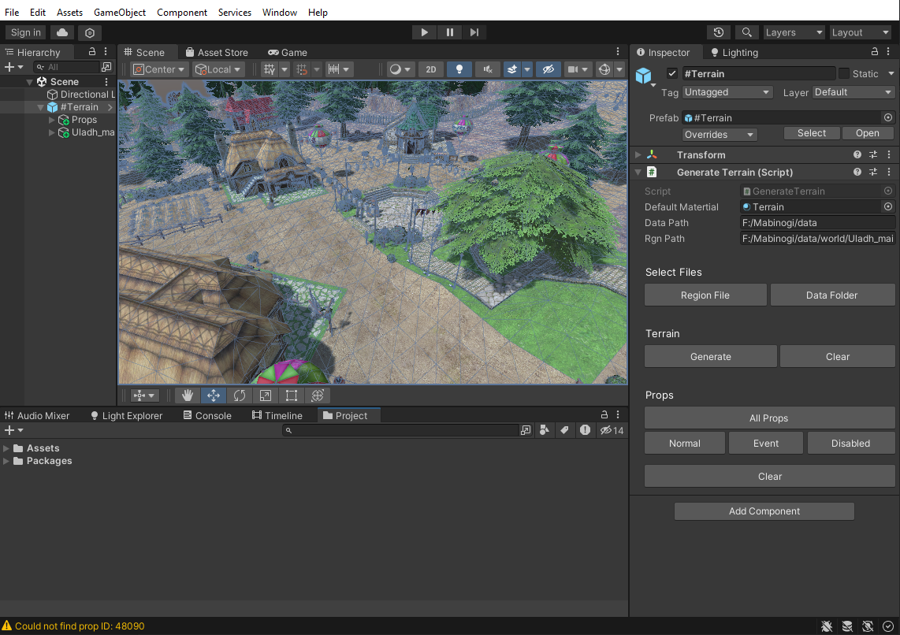

MabiMapper
=============================================
A Unity project used to render terrain from region and area files.

System Requirements
-------------------

- Unity 2022.3.10f1

How to Use
-----------------

1. Select the #Terrain object in the scene.
2. Select an unpacked data folder.
3. Select a region file.
4. Click Generate to construct the terrain.
5. Select which prop types to generate.

*To make the generated terrain/props persistent, remove the tag "Prop" from the prop parent and the "Region" tag from the terrain parent.

Supported Formats
-----------------

Mabinogi's Region (.rgn) file format.

Acknowledgements
----------------

This project wouldn't be possible without [exectails] and his repos.

- Mabioned - Used as inspiration and a foundation for the initial code (MabiWorld).
  https://github.com/exectails/Mabioned
  
- MabinogiFileFormats - The binary templates for mabinogi's file formats.
  https://github.com/exectails/MabinogiFileFormats
  
- DataDog - Used to view/edit Mabinogi's .data files.
  https://github.com/exectails/DataDog
  
